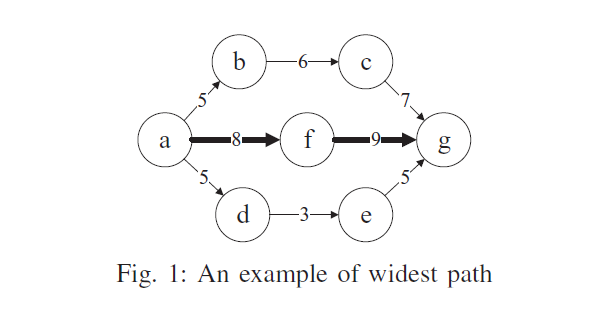
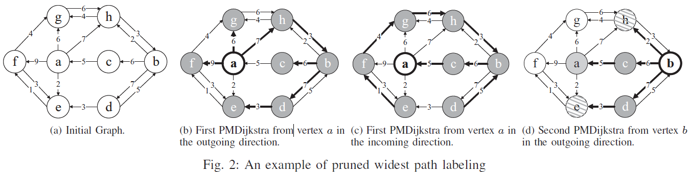

# PWPL
PWPL is a pruned widest path labeling algorithm for fast widest path queries.
# Introduction
The widest path query problem is also called the maximum capacity route problem It is one of the most fundamental operations in many applications. In weighted graphs, there can be multiple paths between two designated vertices. Each path commonly consists of a sequence of edges. The edge with the minimum weight value can be seen as the bottleneck through the path, and the minimum value is called the width of the path. The path which has the maximum width value among all the paths is the widest path between the two designated vertices. Finding the widest path is desired by various applications.

 

# Design of PWPL
The basic idea of PWPL is to compute the 2-hop labeling index. From each vertex v in the graph, we perform a modified Dijkstra algorithm (we call it MDijkstra in short) to obtain the widest paths from v to other vertices, and then store the path information in an index. In each iteration, PWPL tries to prune the vertices during performing the MDijkstra to reduce the index size. Assume we have already performed the MDijkstra from a set of vertexes s and thus the index has already contained the labels that can answer the width queries of widest paths between the pairs of vertices with their widest path pass through w ∈ S. During conducting the MDijkstra from a vertex u ∉ S, when we visit a vertex v, if there exists a vertex w∈S and the widest path width θ(uv) = max{θ(uw),θ(wv)}, then we prune the vertex u, which means we do not visit vertices from u and do not add new labels to those vertices indexes. Therefore, PWPL avoids a significant amount of computations and greatly reduces the index size.

# Intuition 

In this design, we exploit the 2-hop labeling framework and construct a memory efficient 2-hop covering index to achieve fast widest path queries. Specifically, for each vertex u in the graph, we maintain S_{in}(u), a subset of vertices that can reach u, and S_{out}(u), a subset of vertices that can be reached from u, satisfying the following restrictions. For any pair of vertices s and t , there is at least one widest path from s to t passing through a vertex w ∈ S_{out}(s)∩S_{in}(t). We pre-compute the widest path width θ(sw) from s to vertex w ∈ S_{out}(s) and θ(wt) from w∈S_{in}(t). Therefore, we can compute the widest path width from s to t as max{θ(sw), θ(wt)}. We say that the set L_{out}(s)= {(w, θ(sw))} is the outgoing label of s and the set L_{in}(t)= {(w, θ(wt))} is the incoming label of t. The collect of both incoming and outgoing labels of all vertices forms a 2-hop covering index. With such an index, we transform the widest path query operation into two sub-path queries with a merge operation. 

The naïve way to obtain 2-hop covering index is conducting MDijkstra on each vertex and store all the widest path width labels which is unacceptable in space cost obviously. So we must compress the index size. But how to make it? Using existing widest path width labels！At the beginning of PWPL we have to conduct MDijkstra algorithm to calculate width labels and store them all for we don't have any widest path width labels. But after one round of conducting MDijkstra, we already have obtained some widest path width labels, so we can use those labels to cover and removed the redundant labels produced in next calculation. For an example, as shown in Figure 2, after the first round MDijkstra from a, we have obtained the widest path width labels that ah=7 and ba=5. When we continue to execute MDijkstra from b, we can remove the widest path width label that bh=5，because we already obtain the existing labels ah=7 and ba=5 and can obtain the label bh=5 by 2-hop query operation. As the number of compute rounds increases, more and more redundant labels will be removed. So we can obtain an efficient indexes.

# Design of parallel PWPL
We implement the parallel version of PWPL by modifying the constructIndex function and PMDijkstra function in the "pwpl_widestpath.h". In the original PWPL we just start one thread to construct index. In the parallel PWPL, we start n threads to construct Index where n is the number of cpu cores of this machine. At the same time, we assign different threads with the vertices that need to be performed according to the precalculated execution order. For an example, if there are two threads and eight vertices in all. The precalculated execution order is v1, v2, v3, v4, v5, v6, v7, v8. We assign v1, v3, v5, v7 to first thread and v2, v4, v6, v8 to second thread. Although the parallel threads may disrupt the vertices order of PMDijkstra algorithm, which will affect he performance of PWPL, we can set the thread level vertices order statically as v1, v3, v5, v7 or dynamically assign the vertices for different threads to approximately control vertices order compared to original PWPL.

# Building and running PWPL
The input original graph data is a directed weighted graph. See the sample format of graph.txt for details.

g ++ compiler: g ++ 7.3.0

Server: Linux 2.6.32-220.el6.x86_64

Instructions:
$ make // Used to build the program

$ bin / normalquery graph.txt // Run the modified Dijkstra algorithm directly on the original graph, and then enter the vertices s and t to query the shortest path distance.

$ bin / construct_index graph.txt graph.idx // Build the index graph.idx for graph.txt.

$ bin / query_distance graph.idx // The widest path pruning index is constructed, and then enter the vertices s and t to query the widest path distance

$ bin / pll_benchmark graph.idx // index algorithm 100w random node access query widest path width, output average query time

$ bin / normal_benchmark graph.txt // 1000 times MDijkstra random node access to query the widest path width, output the average query time

$ make clean // The program to clear the bin directory

# Author and Copyright
PWPL is developed in Cluster and Grid Computing Lab, Services Computing Technology and System Lab, Big Data Technology and System Lab, School of Computer Science and Technology, Huazhong University of Science and Technology, Wuhan, China by Rui Pan(ruipan@hust.edu.cn), Hanhua Chen (chen@hust.edu.cn), Wangcheng Zhang(wangczhang@hust.edu.cn), Hai Jin (hjin@hust.edu.cn).

Copyright (C) 2019, STCS & CGCL and Huazhong University of Science and Technology.
